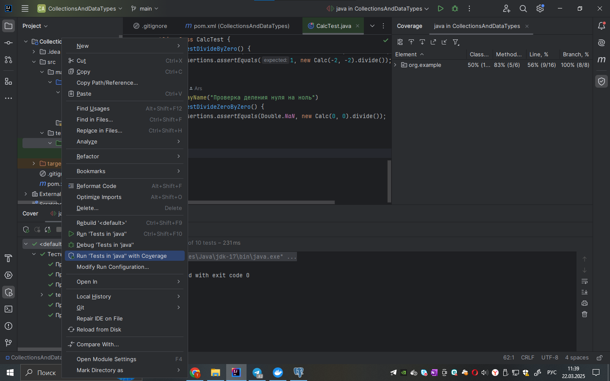

### Это проект для понимания тестирования на JUnit. Я сделал обычный калькулятор с ООП, и в папке test делал тесты.

### Процент покрытия:
- Процент покрытия ветвлений тестами - 100%
- Процент покрытия строк тестами - 56%
- Процент покрытия методов тестами - 83%
- Процент покрытия классов тестами - 50%

### Как я посчитал?
## В Intellij IDEA есть возможность запуска тестов с Coverage, который всё это считает. Показываю на картинке (кликал правой кнопкой мыши на папку java)

## А потом, после запуска вы всё увидете

